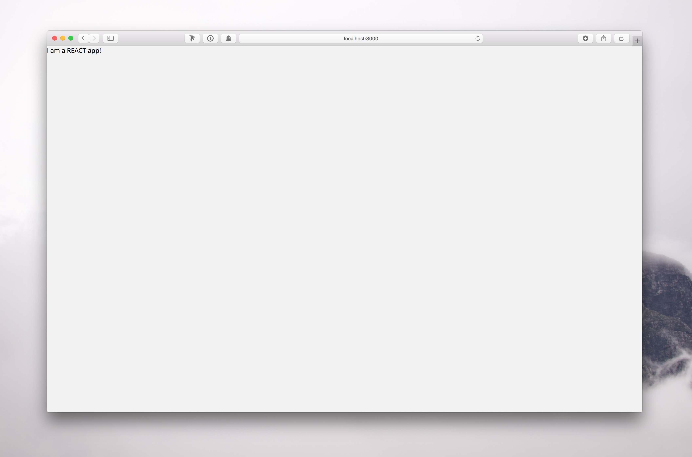

## Exercise 01: Warm up

### Running the application

It's time to get started! Let's clone and initialise our project in order to get our development environment up and running.

```sh
git clone https://github.com/learnrelay/pokedex.git
cd pokedex
git checkout step-01
# copy and paste your endpoint from above to `package.json`
npm install
npm start  
# Open localhost:3000
```

Now, you should be able to visit [http://localhost:3000](http://localhost:3000) to see your beautiful Pokedex application, which should look like this:



Great, let's move on!

### Getting familiar with the application

The project code is in the `src` folder. Right now, our project contains the `index.js` file in `src` and the `ListPage.js` view and its associated styling file `ListPage.css` in `src/views`.

To get a feeling of the features Relay offers, let's have a look at `index.js`. We will revisit all of the below in a following chapter.

* Apart from the common React packages, we import `react-relay` and `react-router-relay`:

```javascript
import React from 'react'
import Relay from 'react-relay'
import ReactDOM from 'react-dom'
import ListPage from './views/ListPage'
import { Router, Route, browserHistory, applyRouterMiddleware } from 'react-router'
import useRelay from 'react-router-relay'
import './index.css'
```

`react-relay` contains the `Relay` object that we will use heavily throughout this guide.
`react-router-relay` can be used in combination with `react-router`.

* In [Environment Setup](#environment-setup), we pointed Relay to our `schema.json` file by using the `graphql-config` helper package. Additionally to the schema file, Relay also has to know the GraphQL endpoint of our backend. This is referred to as the *Network Layer*. For most applications it is enough to use the `DefaultNetworkLayer` provided by Relay:

```javascript
Relay.injectNetworkLayer(
  new Relay.DefaultNetworkLayer('https://api.graph.cool/relay/v1/__PROJECT_ID__')
)
```

Again, make sure to copy your GraphQL endpoint from above to `package.json` and `index.js`.

* Many queries in Relay are wrapped by the so called `viewer` object. We can define it once and use it whenever we want to make a query against the viewer field:

```javascript
const ViewerQueries = { viewer: () => Relay.QL`query { viewer }` }
```

* In the last part of `index.js`, we set up the router with the `Relay.Store` and assign our `ListPage` view to the route `/`.

```javascript
ReactDOM.render(
  <Router
    forceFetch
    environment={Relay.Store}
    render={applyRouterMiddleware(useRelay)}
    history={browserHistory}
  >
    <Route path='/' component={ListPage} />
  </Router>
  , document.getElementById('root')
)
```
