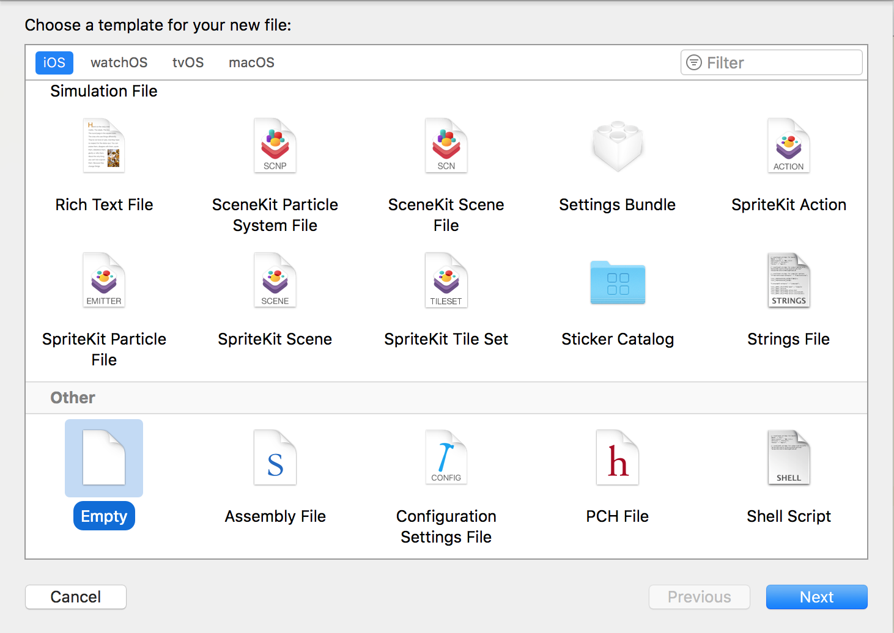

# Tutorial 02 - Basic Queries

This is the 2nd exercise in the **iOS Track** of this Apollo Client Tutorial!

## Goal

The **goal** of this exercise is to query information on your very own trainer node. We will use it to add a personal touch to the greeting in our pokedex:


## Introduction

Open the directory that contains the 2nd exercise (`exercise-02`) and open `pokedex-apollo.xcworkspace`. It already contains a running version of the code you wrote in the previous lesson.

Before we start firing off some queries, let's first take a look at the GraphQL schema we will be working with throughout this tutorial: 

```graphql
type Trainer {
  id: String!
  name: String
  ownedPokemons: [Pokemon]
}

type Pokemon {
  id: String!
  url: String!
  name: String!
  trainer: Trainer
}
```

We manage pokemon _trainers_ that may _own_ several _Pokemons_ and are identified by both an _id_ and a _name_. A pokemon has an _id_, a _url_ and a _name_ and may be related to a _trainer_. Note that the exclamation points after the type declarations mean that these fields are mandatory.

Let's now build a GraphQL query together to get the information of your trainer node stored on the server and change the message displayed in `PokedexTableViewController.swift`.


## Displaying Information Of Your Trainer

### Creating Your First GraphQL Query

The GraphQL server for the Pokedex app is configured so that we can identify trainers by their name. To query the information of a trainer given their name, you can use the following query:

```graphql
query Trainer {
  Trainer(name: "__NAME__") {
    id
    name
  }
}
```

This query will return the `id` and the `name` of the `Trainer` that is called `__NAME__`.

> Note: You can copy this query directly into the [GraphiQL](https://api.graph.cool/simple/v1/__PROJECT_ID__) playground and inspect the results there.

All right, but how can we use this query in our code and how do we leverage the Swift type system as was promised before?

The first thing we need to do in order to use this query is adding it to our project in a `.graphql` file. The script in the build phase will actually assemble and merge all `.graphql` files that are contained in the project and treat them as one single `.graphql` file. This means that we have all the freedom we want to organize our queries across different files. However, by convention you should define your queries in files that relate to your actual `.swift` files. So, in our case, since we need the result data from the query in the `PokedexTableViewController.swift`, we should create a file called `PokedexTableViewController.graphql` that contains all the queries that fetch the data we want to display on this view controller. In Xcode, there is of course no template for `.graphql` files, so you need to create an _empty_ new file.

.

> Note: You can even use syntax highlighting for GraphQL queries via an Xcode plugin. Follow the instructions in the [Apollo iOS Guide](http://dev.apollodata.com/ios/installation.html#installing-xcode-add-ons) to set it up.

Next, copy the query from above into that newly created file. Build the project using `CMD + B` and then inspect the project's root directory on the file system. As quickly mentioned before, you'll find the `API.swift` file in there, however we still need to add it to our project manually. In the Xcode project, right click on the group `GraphQL` and select **Add Files to "pokedex-apollo"...** from the menu, then select `API.swift` from the file system and click **Add**. The file has now been added to your project. You only have to do this once as the file will remain in the project and will be updated there on every build.


### Inspecting `API.swift`

At this point, `apollo-codegen` generated the `API.swift` file for us. The contents of this file represent all the GraphQL queries, mutations and fragments that we include in our project. In our case, this is only one query so far which fetches the trainer called `__NAME__`.

Each query will be represented by its own class within `API.swift`, and the data that it fetches is represented through structs that are _nested_ inside of that class. `apollo-codegen` will also automatically append the word `Query` to every query that we define, this is why our only class at this point is called `TrainerQuery`. Since we're only asking for one GraphQL field, we only have one nested struct that is called `TrainerQuery.Data.Trainer`. 


### Using the `TrainerQuery`

We are now ready to finally make our first API request using the `TrainerQuery` that was just generated for us.

In the `PokedexTableViewController.swift`, add the following method:

```swift
func fetchTrainer() {
    let trainerQuery = TrainerQuery()
    apollo.fetch(query: trainerQuery) { result, error in
        if let error = error {
            print(#function, "ERROR | An error occured: \(error)")
            return
        }
        guard let trainer = result?.data?.trainer else {
            print(#function, "ERROR | Could not retrieve trainer")
            return
        }
        print(trainer.name!)
    }
}
``` 

Then in the last line of `viewDidLoad()`, call the method: `fetchTrainer()`. If you run the app now, you should see your name being printed to the console. 

Let's take a step back and understand what happened. In `fetchTrainer()`, we first instantiate a `TrainerQuery`. Right now, we hardcoded the trainer's name in the `PokedexTableViewController.graphql` file, so we don't pass any arguments to the query's initializer. We then use the `trainerQuery` instance and pass it to the `fetch()` method of our `ApolloClient` instance. We also pass a callback (using Swift's trailing closure syntax) to deal with the return value from our query which is either a `GraphQLResult` carrying the returned `TrainerQuery.Data.Trainer` instance or an `Error`.

But we surely want to do more with the result than printing, that is actually displaying it in the topmost cell of our table view.

Add the following property to the `PokedexTableViewController`:

```swift
var trainer: TrainerQuery.Data.Trainer? {
    didSet {
        tableView.reloadData()
    }
}
```

Next, replace the contents of `tableView(_ tableView: UITableView, cellForRowAt indexPath: IndexPath)` with: 

```swift
switch indexPath.section {
      case Sections.greeting.rawValue:
          let greetingString: String
          if let name = trainer?.name {
              greetingString = "Hello \(name), you have 0 Pokemons in your Pokedex."
          }
          else {
              greetingString = "Hello, you have 0 Pokemons in your Pokedex."
          }
          let cell = tableView.dequeueReusableCell(withIdentifier: "GreetingCell", for: indexPath) as! GreetingCell
          cell.greetingLabel.text = greetingString
          return cell
      case Sections.pokemons.rawValue:
          fatalError("ERROR: Not yet implemented")
      default:
          fatalError("ERROR: Unknown section")
      }
```

Finally, in `fetchTrainer()`, replace the last line which was printing the trainer's name with:

```swift
self.trainer = trainer
```

As we are reassigning the `trainer` property after receiving the trainer data from the API, the `didSet` property observer is invoked and the data in our table view gets reloaded.

If you run the app now, the topmost cell should have changed its greeting text to: `Hello __NAME__, you have 0 Pokemons in your Pokedex.`


## Recap

Fantastic! You just executed your very first GraphQL query and used the results in a table view. On to the next lesson where we'll learn more about queries. But before, let's quickly revisit what we learned:
- GraphQL queries need to be added to `.graphql` files
- `apollo-codegen` creates `API.swift` and in there generates Swift types based on the queries
- A query is sent using the `fetch()` method on `ApolloClient`  


