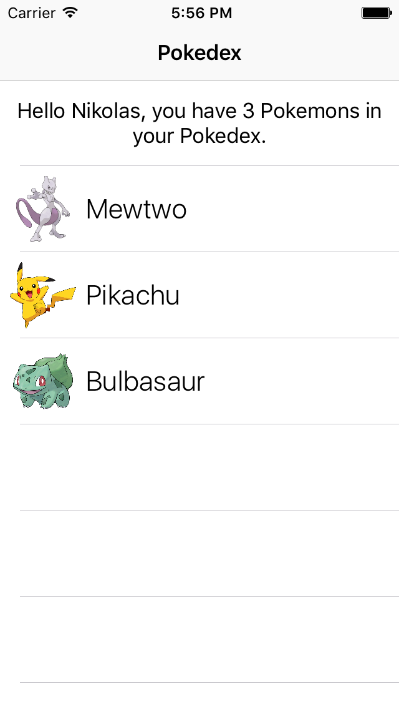

# Tutorial 03 - Advanced Queries

This is the third exercise in the **iOS Track** of this Apollo Client Tutorial!

## Goal

In this exercise we will have a look at advanced query features with the **goal** of showing a list of pokemon that our trainer owns:




## Introduction

Open the directory that contains the third exercise `exercise-03` and open the `pokedex-apollo.xcworkspace`-file. It already contains a running version of the code you wrote in the previous lesson.


## Display a list of pokemons with advanced queries

Before we start working directly on our goal to show the pokemons a trainer owns, let's take some time to get more familiar with some of the available options when using queries.

### Query Variables

In the previous lesson, our query contained a hardcoded string that was the trainer's name. Often times you'll however want to introduce dynamic behaviour in queries, that is we don't want to hardcode values but rather introduce them at runtime. This way, the queries we write are much more useful and can be reused in different contexts. In the Pokedex example, the app could be extended to show the Pokedexes of multiple trainer, but we won't know _all_ the available trainers beforehand and certainly don't want to write identical queries for all of them.

So, let's see how we can use query variables to solve this issue. Here is the same query we used before, only that this time the name of the trainer can be passed into the query as a variable:

```graphql
query Trainer($name: String!) {
  Trainer(name: $name) {
    id
    name
  }
}
```

> Note: If you want to test this query in [GraphiQL](https://api.graph.cool/simple/v1/__PROJECT_ID__), you'll have to add the query variable in the bottom left panel: `{ "name": "__NAME__"}`.

Let's quickly understand the syntax of the parametrized query. When declaring the query named `Trainer`, we can add as many arguments to it as we like by listing them in parantheses. For each argument, we need to provide a name and a type. In our case, we only have one (mandatory) argument called `name` that is of type `String`. Variables are always prepended with a `$`. Then, _inside_ the query we can just access the variable by referencing it with its name. 

Go ahead and replace the existing query in `PokedexTableViewController.graphql` with the new query that accepts the trainer's name as a variable, then build the project again using `CMD + B` and inspect `API.swift`. The only initializer of `TrainerQuery` now takes a `String` as an argument which it assigns to a newly added property called `name`. This is also precisely the reason why the compiler throws an error right now, since in our previous usage of the initializer in `PokedexTableViewController.swift`, we didn't provide any arguments. So, let's go and fix that!

Open `PokedexTableViewController.swift` and add the `name` argument when instantiating `TrainerQuery`:

```swift
let trainerQuery = TrainerQuery(name: "__NAME__")
```

Run the app again to validate that everything still works as before.


### Nested Queries

Now that we saw query variables in action, we can focus on displaying the Pokemons of a given trainer. We are going to use the second section of our table view for that, each pokemon will be displayed in a `PokemonCell`.

Therefore, we need to be able to ask for all the `ownedPokemons` of a trainer. We can do so by _nesting_ a query for pokemon data inside the query for the trainer. It'll look like this:

```graphql
query Trainer($name: String!) {
  Trainer(name: $name) {
    id
    name
    ownedPokemons {
      id
      name
      url
    }
  }
}
```

Nested queries are where GraphQL really shines compared to REST. With a REST API, it usually requires multiple calls to request data that goes over one or two relationships in your data model, with GraphQL all data requirements can be specified upfront in the query and the data can be fetched within only one API call.

The above query requests all pokemons owned by the trainer called `$name`. The pokemons will be returned as an array, and each of them will have an `id`, a `name` and a `url`.

Go ahead and replace the existing query in `PokedexTableViewController.graphql` with the query above, then hit `CMD + B` and inspect `API.swift` again. 

We just got another nested struct, this time it's called `OwnedPokemon` and nested inside `TrainerQuery.Data.Trainer`. This well reflects the nesting inside the query. Also notice that the `TrainerQuery.Data.Trainer` got a new property, which is an array of `TrainerQuery.Data.Trainer.OwnedPokemon`.

Let's use this new data in our code! In `PokedexTableViewController.swift`, we can now make use of the fact that the `TrainerQuery.Data.Trainer` knows its owned pokemons, so we can actually display the correct number of pokemons rather than a hardcoded `0`. Change the generation of the `greetingString` inside `tableView(_ tableView: UITableView, cellForRowAt indexPath: IndexPath)` as follows:

```swift
let greetingString: String
if let name = trainer?.name,
   let ownedPokemons = trainer?.ownedPokemons {
    greetingString = "Hello \(name), you have \(ownedPokemons.count) Pokemons in your Pokedex."
}
else {
    greetingString = "Hello, are you even a trainer?!"
}
```

Next, we also want to return the right number of cells for the second table view section, so inside `tableView(_ tableView: UITableView, numberOfRowsInSection section: Int)`, change the last return statement to:

```swift
return trainer?.ownedPokemons?.count ?? 0
```

Finally, we actually want to display the Pokemons on the table view cells. Therefore, let's add a new property to `PokemonCell`:

```swift
var ownedPokemon: TrainerQuery.Data.Trainer.OwnedPokemon? {
    didSet {
        updateUI()
    }
}
```  

We're using the `didSet` property observer again to update the UI elements right after the `ownedPokemon` was assigned, so let's next add the `updateUI()` method we want to invoke here:

```swift
func updateUI() {
    if let name = ownedPokemon?.name {
        nameLabel.text = name
    }
    if let pokemonURL = ownedPokemon?.url {
        request = Alamofire.request(pokemonURL).responseImage { [unowned self] response in
            if let image = response.result.value {
                self.pokemonImageView.image = image
            }
        }
    }
}
```

Running the app now will display all your Pokemon in the second table view section.


