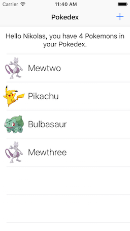

# Basic Mutations

Welcome to the 4th exercise in the **iOS Track** of this Apollo Client Tutorial!


## Goal

In this exercise, our **goal** is to add new Pokemons to the Pokedex. Therefore, we are going to learn about _mutations_.


## Introduction

Open the directory that contains the 4th exercise (`exercise-04`) and open `pokedex-apollo.xcworkspace`. 

It already contains a running version of the code you wrote in the previous lesson, however we made a few minor changes: We "untangled" the information about the trainer and now, rather than storing one property `trainer` of type `TrainerQuery.Data.Trainer` in `PokedexTableViewController`, we now store three individual properties which are the trainer's `id`, `name` and `ownedPokemons`. All parts of the code where `trainer` was used before have been updated accordingly.

We also added a new view controller called `CreatePokemonViewController` that will allow us to enter data for a new Pokemon in our Pokedex. When segueing from the `PokedexTableViewController` to the `CreatePokemonViewController` we are passing the trainer's ID, so that we can provide this information upon creation of a new Pokemon.


## Using _Mutations_ To Add New Pokemons

### Mutations In GraphQL

So far, we only learned about _queries_, a GraphQL concept that allows us to _fetch_ data from an API. However, in most applications we actually also want to be able to change the data in the backend either by updating existing data entries or creating completely new ones. In GraphQL, this can be done via _mutations_.

Mutations are very similar to _queries_, but when defining them in our `.graphql` files, we need to use the keyword `mutation` instead of `query`. The **Apollo iOS client** will then, similar to queries, generate one class per mutation.


### Adding a New Pokemon

Let's see what a mutation for adding a new Pokemon would look like:

```graphql
mutation CreatePokemon($name: String, $url: String!, $trainerId: ID) {
  createPokemon(name: $name, url: $url, trainerId: $trainerId) {
    id
    name
    url
  }
}
```

> Note: Similar to queries, you can execute this mutation in [GraphiQL](https://api.graph.cool/simple/v1/__PROJECT_ID__). Don't forget to add the query variables for `$name`, `$url` and (potentially) `$trainerId`. 

The above mutation will create a new Pokemon with the provided data. Similar to a query, we can specify the return data of the request. In this case, we're asking it to return the full data for the newly created Pokemon, i.e. `id`, `name` and `url`. This is helpful as it allows us to update the UI directly using the response of our mutation!

To use this mutation in our app, create a new _empty_ file called `CreatePokemonViewController.graphql`, copy the above mutation into this new file and hit `CMD + B` to build the project, then inspect the contents of `API.swift`. 

As you can see, `apollo-codegen` once again did a great job and generated a new class for us called `CreatePokemonMutation`. Its structure is very similar to the queries, in that it has a nested struct called `CreatePokemon` with properties `id`, `name` and `url` that represents our new Pokemon.


### Using the New `CreatePokemonMutation`

Let's now go and use the mutation in our code! Open `CreatePokemonViewController.swift` and copy the following code snippet into the `addPokemon()` method right after the `guard` statement:

```swift
let createPokemonMutation = CreatePokemonMutation(name: name, url: imageURL, trainerId: trainerId)
activityIndicator.startAnimating()
apollo.perform(mutation: createPokemonMutation) { [unowned self] (result: GraphQLResult?, error: Error?) in
    self.activityIndicator.stopAnimating()
    if let error = error {
        print(#function, "ERROR | An error occured while adding the new Pokemon: \(error)")
        return
    }
    guard let newPokemon = result?.data?.createPokemon else {
        print(#function, "ERROR | Could not get the new Pokemon")
        return
    }
    print("Created new pokemon: \(newPokemon)")
    self.presentingViewController?.dismiss(animated: true)
}
```

Let's take a step back again and understand what's going on. We instantiate the `CreatePokemonMutation` that was generated through `apollo-codegen`, passing the values we retrieved from the text fields as well as the trainer's ID as arguments. We then use our `ApolloClient` instance, to `perform` a mutation this time rather than `fetch`ing data based on a query. Once more, we are using Swift's trailing closure syntax to pass in a callback so that we can handle the return values of our request. In this case, if the mutation is successful, we might receive the data of the new pokemon and finally print it to the console.

Run the app and create a new Pokemon, called **Mewthree** using **Mewtwo's** image URL: `http://cdn.bulbagarden.net/upload/thumb/7/78/150Mewtwo.png/250px-150Mewtwo.png`.  

You should see an output similar to the following in the console: 

```
Created new pokemon: CreatePokemon(__typename: "Pokemon", id: "cixm4hazlitwt01693wg9mey5", name: Optional("Mewthree"), url: Optional("http://cdn.bulbagarden.net/upload/thumb/7/78/150Mewtwo.png/250px-150Mewtwo.png"))`
```

So, we successfully added a new Pokemon to our database, you can verify this in [GraphiQL](https://api.graph.cool/simple/v1/__PROJECT_ID__). However, **the table view doesn't yet display this new Pokemon!**


### Updating The UI With The New Pokemon

If you restart the app now, you'll notice that **Mewthree** has been successfully added to your Pokedex. However, it would be nice if the table view updated right after we added the new Pokemon so that we don't have to restart the app every time to see the new additions to our Pokedex.



Since we are managing the array `var ownedPokemons: [TrainerQuery.Data.OwnedPokemon]?` in our `PokedexTableViewController` ourselves, we could just use the returned data of the new Pokemon that we receive from performing the mutation to append a new Pokemon to that array. 

**...but wait!** The Pokemon that is returned after we performed our mutation is of type `CreatePokemonMutation.Data.CreatePokemon` whereas the array in `PokedexTableViewController` contains Pokemons of type `TrainerQuery.Data.OwnedPokemon`. Though both of these structs carry the exact same information, we can't actually convert them easily because they don't expose the required initializers. Of course, we could write these initializers ourselves inside of `API.swift`, but this is **definitely not** something we're supposed to do!

> Note: `API.swift` is an auto-generated file and thus should never be modified by us! Any changes will be overidden the next time we build the project!

So, how do we deal with this dilemma? The solution is called _fragments_ and will be discussed in the next lesson!


## Recap 

In this exercise, we added functionality to our app that allows to add a new Pokemon to our Pokedex. Here is a summary of what we learned:
- _Mutations_ are used in GraphQL to update data in the backend
- Syntactically, they are similar to queries but use the keyword `mutation` instead of `query`
- `apollo-codegen` will generate one class per _mutation_
- The method `perform()` of `ApolloClient` can be used to actually execute a mutation in the backend
- There are issues with the fact that we have different types that carry the same information which can be solved with _fragments_


