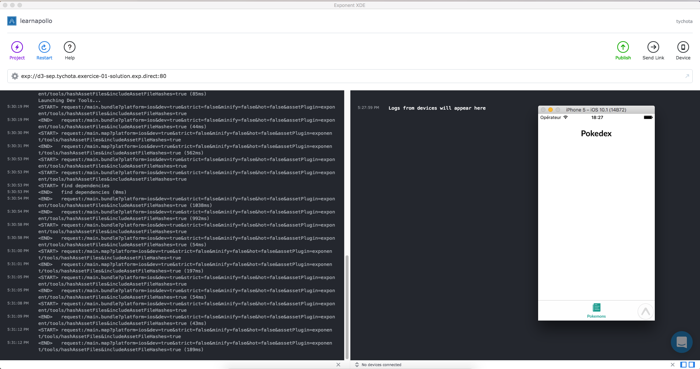

# Tutorial 01 - Getting Started

Welcome to the first exercise in the **React Native Exponent Track** of this Apollo Client Tutorial!
If you prefer React or React Native Vanilla over React Native Exponent, head over to the respective tutorial track.

## Goal

The **goal** of this first exercise is to install a React Native App and run it afterwards.
You will get familiar with the infrastructure surrounding Apollo Client for React Native and with the App structure of the Pokedex.

## Prerequisites

This tutorial uses [ExponentJS](https://getexponent.com/).

ExponentJS is a macro framework over React Native, that is batteries included.
Using it will help getting to the point, instead of spending time setting up navigator, custom font ect..

Note that you can you raw react native too.

@TODO : show a diff between final exponent exercice and react native version.

## Introduction

If you've signed up with GitHub, you can receive your own `pokedex-react-native-exponent` here:

<!-- __DOWNLOAD_RNEXPONENT__ -->

Now change to the first exercise and install the dependencies from your console:

```sh
cd pokedex-react-native-exponent/exercise-01-initial
yarn install # or npm install
```

## Getting Familiar

Let's take a moment to get more familiar with the structure of the app before we run it.

* `./.exponent` - gitignored preferences of your exponent XDE
* `./assets` - custom font or image
* `./components` - common react component like `BaseText` (to have a custom font by default)
* `./constants` - color, layout constants for style consistancy
* `./navigation` - router (based on Navigation Experimental) and Tab navigation
* `./screens` - screens and assoictated components
* `./state` - configuration of redux store
* `./utilities` - utilities
* `./exp.json` - configuration of exponent project
* `./main.js` - root file of the project

## Exercice

### Package Dependencies

Install two packages:

* `apollo-client` - the core package exposes the vanilla JS Apollo Client which provides the core functionality
* `react-apollo` - the React integration exposes the `ApolloProvider` that can be used to wrap other React components,
  allowing them to send queries and mutations

```sh
yarn add apollo-client react-apollo
```

### Add a Apollo Client

Create a file in `./state/Apollo.js` with the following content.

```js
import ApolloClient, { createNetworkInterface } from 'apollo-client';

const client = new ApolloClient({
  networkInterface: createNetworkInterface({ uri: 'https://api.graph.cool/simple/v1/__PROJECT_ID__'}),
});

export default client;
```

If you already received your own GraphQL server, `__PROJECT_ID__` is replaced with your individual GraphQL endpoint.

This client will perform the API call and manage the cache.

### Modify Redux store

In order to connect apollo to the existing store, modify `./state/Store.js`:

```js
// ...
import { combineReducers, createStore, compose, applyMiddleware } from 'redux';
import client from 'learnapollo/state/Apollo.js';

// ...
const store = createStoreWithNavigation(
  combineReducers({
    // ...,
    apollo: client.reducer()
  }),
  compose(
    applyMiddleware(client.middleware()),
  )
);

// ...
```

This allow redux to intercept apollo queries and then apollo to write on
Redux store.

### Add the Provider

To allow our React components to issue GraphQL queries and mutations through the client, we wrap them
with the `ApolloProvider` component from the `react-apollo` package.

It is 100% similar to what Redux does with `react-redux`.

To do this, modify the `./main.js` to wrap the NavigationProvider inside ApolloProvider.

```js
import Store from 'learnapollo/state/Store';
import Client from 'learnapollo/state/Apollo';

// ...
class AppContainer extends Component {
  render() {
    // ...
        return (
          // ...
          <ApolloProvider store={Store} client={Client}>
            <NavigationProvider router={navigationContext}>
              <StackNavigation
                id="root"
                initialRoute={initialRoute}
              />
            </NavigationProvider>
          </ApolloProvider>
          // ...
        )
        // ...
  }
}
```

> Note: You don't have to put `ApolloProvider` on the highest level of the component hierarchy - however,
  every component that wants to use Apollo Client needs to be a direct or indirect children
  of `ApolloProvider` in the component hierarchy.

Our Home component lives in `'screen/Home.js'`. Currently, it only contains a generic title, but that will change soon!
We will further expand this component in the following exercises to give an overview about all the pokemon in your
Pokedex as well as the possibility to add new pokemons or update existing ones.

But for now, let's make sure you are ready to go.

## Starting the App

To confirm your environment is all correctly setup, start the app now from XDE:



Click on `Device` to start the iOS Simulator.

## Recap

Great, you did it!
You successfully ran the React Native App and got familiar with its general structure.
Let's quickly summarize what we learned so far:

* To use the **Apollo Client**, we need to import it from `apollo-client` and setup its **networkInterface**
* We can **issue queries and mutations** in our React components by wrapping them in the **Apollo Provider**
  found in `react-apollo`
* We will use the **Home component** to list our pokemons and to offer other features
