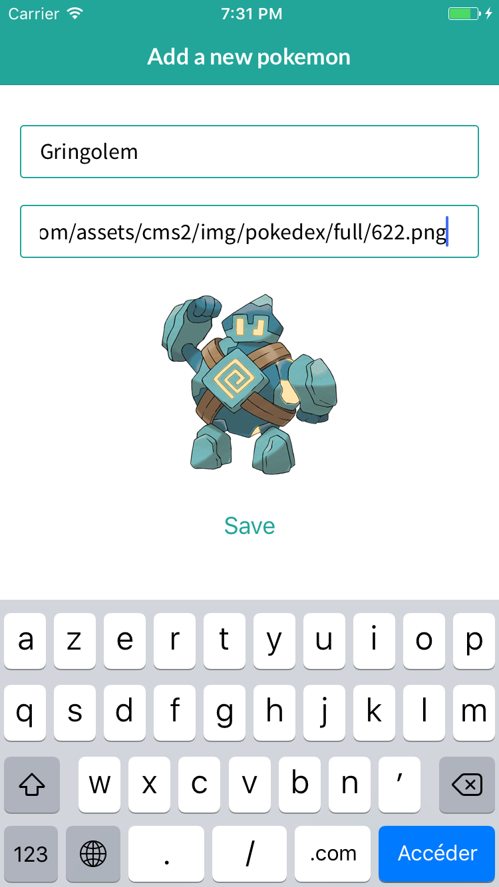

# Tutorial 05 - Basic Mutations

Welcome to the first exercise in the **React Native Exponent Track** of this Apollo Client Tutorial!
If you prefer React or React Native Vanilla over React Native Exponent, head over to the respective tutorial track.

## Goal

In this exercise we have the **goal** of adding the possibility to create new pokemons:




A button in the pokedex will redirect to the new component. After creating the pokemon it will appear in our pokedex:

Data changes in GraphQL are done by using mutations, so it's time for us to learn about them.

## Introduction

Move to the 5th exercise and install the dependencies from your console:

```sh
cd pokedex-react-exponent/exercise-05-initial
yarn install
```

## Adding new pokemons to the pokemon list

Currently we have a cool, shiny list of pokemons that are assigned to our trainer node. However, pokemon trainers are supposed to catch new pokemons once in a while, so we should account for that in our pokedex.

### Adding a button to the `Pokedex`

We already prepared a new screen `PokemonAddScreen` that lets us create new pokemons.

In order to do that, we have added a new `TabNavigationItem` in `navigation/RootNavigation.js`:

```js
  render() {
    return (
      <TabNavigation
        tabBarHeight={56}
        initialTab="pokemons">
        <TabNavigationItem
          id="pokemons"
        >
        {/* Initial "Your Pokemeons" tab */}
        </TabNavigationItem>
        <TabNavigationItem
          id="detail"
          renderIcon={isSelected => this._renderIcon('Add a Pokemon', 'ios-add-circle', isSelected)}>
          <StackNavigation
            defaultRouteConfig={defaultRouteConfig}
            initialRoute={Router.getRoute('pokemonAdd')}
          />
        </TabNavigationItem>
      </TabNavigation>
    );
  }
```

we have also add the route inside `navigation/Rooter.js`:

```js
export default createRouter(() => ({
  pokemonsList: () => PokemonsListScreen,
  pokemonDetail: () => PokemonDetailScreen,
  pokemonAdd: () => PokemonAddScreen,
  rootNavigation: () => RootNavigation,
}));
```
Last but not least we have created a screen directory.

### Adding the createPokemon mutation to `AddPokemonCard`

Right now, the `PokemonAddForm` doesn't do too much. As we want to create a new pokemon node at the server,
now is the time to think about the right mutation for this. Let's first think about the data that is
needed for creating a new pokemon. Of course, we need the name and the image URL of the new pokemon.

Additionally we also need the trainer id to relate the pokemon to the trainer and vice-versa.
The mutation we need to use is called `createPokemon`, which leaves us with the following mutation:

```js
const createPokemonMutation = gql`
  mutation createPokemon($name: String!, $url: String!, $trainerId: ID) {
    createPokemon(name: $name, url: $url, trainerId: $trainerId) {
      trainer {
        id
        ownedPokemons {
          id
        }
      }
    }
  }
`
```

Note that as we discussed above, the mutation requires the variables `$name`, `$url` and `$trainerId`.
We can inject the mutation similar to how we inject queries to `PokemonAddForm`:

```js
export const PokemonAddFormWithMutation = graphql(createPokemonMutation)(PokemonAddForm)
```

But wait, how do we supply the needed variables to the mutation? Let's find out!

### Using mutations in components

Other than with queries, injecting mutations doesn't add the query result but the mutation itself as a
function. Inside the wrapped component, we can access the mutation via `this.props.mutate`, which is a
function that accepts the mutation variables as parameters. So let's first add the new required
prop `mutate` at the top of the `PokemonAddForm` class:

```js
static propTypes = {
  mutate: React.PropTypes.func.isRequired,
}
```

Now we can call the `createPokemon` mutations by using `mutate` in `handleSave`:

```js
handleSave = () => {
    const {name, url} = this.state;
    const trainerId = this.props.trainerId;
    this.props.mutate({variables: {name, url, trainerId}})
      .then(() => {
        this.props.onSave();
      });
  }
```

Note how we provide the variables using the `variables` object.
As you can see, the mutation return a promise, so we can chain another function by using `then` to
return back to the pokemon list.

Check if you got everthing right by running your project in XDE.
Click the add button. Add the pokemon name and image URL and click the save button.

Weird, the pokemon is not displayed right away, only after refreshing the page.
Exponent does not unmount the component when we are switching between screens. 
Thus, the query is not executed again and the list not updated.

We have too way of fixing this:
- refetching when the list get focused again
- update the list on mutation result, by providing a reducer that will change the internal state

Lets focus for now on reloading the whole list : go and edit the `PokemonsList` component:

```js
import { createFocusAwareComponent } from '@exponent/ex-navigation';

// ...

@createFocusAwareComponent
export class PokemonsList extends Component {
  //...
  componentWillReceiveProps(nextProps) {
    const { data } = nextProps;
    if (!data.loading && !data.error) {
      //...
      if (nextProps.isFocused && !this.props.isFocused) {
        this.props.data.refetch();
      }
    }
  }

}
```

If the screen wasn't focused, but is going to be foucsed on next frame, we call `refetch`and fire the list query again.

Please open your project in the XDE and check that the adding a pokemon update the query.

## Recap

Now that you got to use mutations you already know a lot about Apollo Client, good job!
Let's review what we saw in this exercise:

* **Mutations** are used to change data on the server
* Calling mutations returns a **promise that can be used to react on mutation results**
* **Wrapping a component with `graphql`** from `react-apollo` using a mutation injects the `mutate` prop
to the inner component
* Other than with queries, **mutation variables can be assigned in the inner component** making it easy
to use the components state as variable inputs
