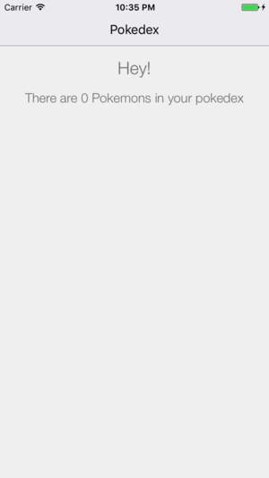

# Tutorial 01 - Getting Started

Welcome to the first exercise in the **React Native Vanilla Track** of this Apollo Client Tutorial! If you prefer React or React Native Exponent over React Native Vanilla, head over to the respective tutorial track.

<iframe width="560" height="315" src="https://www.youtube.com/embed/TiqPHEzSOg0" frameborder="0" allowfullscreen></iframe>

## Goal

The **goal** of this first exercise is to install a vanilla React Native App and run it afterwards. You will get familiar with the infrastructure surrounding Apollo Client for React Native and with the App structure of the Pokedex.

We will see a generic greeting in our pokedex at the end of this exercise:


## Introduction

If you've signed up with GitHub, you can receive your own `pokedex-react-native-vanilla` here:

<!-- __DOWNLOAD_RNVANILLA__ -->

Now change to the first exercise and install the dependencies from your console:

```sh
cd pokedex-react-native-vanilla/exercise-01
yarn install # or npm install
```

## Getting Familiar with the App

Let's take a moment to get more familiar with the structure of the app before we run it.

The starting point for our App is `src/client.js`. At the moment, all that happens here is setting up the router to render the `Pokedex` component for the `/pokedex` route path:

```js
import React from 'react'
import { Actions, Scene, Router } from 'react-native-router-flux'

import Pokedex from './components/Pokedex'

const scenes = Actions.create(
  <Scene key='root'>
    <Scene key='pokedex' component={Pokedex} title='Pokedex' initial={true} type='replace' />
  </Scene>
)

export const routes = (
  <Router scenes={scenes}/>
)
```

In `index.android.js` and `index.ios.js`, we then simply register the `PokedexRNVanilla` app with `routes`:

```js
import { AppRegistry } from 'react-native'
import { routes } from './src/client'

AppRegistry.registerComponent('PokedexRNVanilla', () => () => routes)
```

## Adding Apollo Client to the App

Let's see how we can add Apollo Client to our App together by adding these changes to `src/client.js`.

### Package Dependencies

Open `src/package.json` to have a look what packages we are using.

* `apollo-client` - the core package exposes the vanilla JS Apollo Client which provides the core functionality
* `react-apollo` - the React integration exposes the `ApolloProvider` that can be used to wrap other React components, allowing them to send queries and mutations

Now go ahead and import the following at the top of `src/client.js`:

```js
import ApolloClient, { createNetworkInterface } from 'apollo-client'
import { ApolloProvider } from 'react-apollo'
```

### Configuring Apollo Client with our GraphQL server

Now we can connect Apollo Client with our GraphQL server in `src/client.js` by configuring the network layer. Paste the following right after the imports in `src/client.js`:

```js
const client = new ApolloClient({
  networkInterface: createNetworkInterface({ uri: 'https://api.graph.cool/simple/v1/__PROJECT_ID__'}),
})
```

If you signed up with GitHub and downloaded the example, we already inserted your individual GraphQL endpoint for the following exercises.

### Connecting Apollo Client to our React Components

To allow our React components to issue GraphQL queries and mutations through the client we wrap them with the `ApolloProvider` component from the `react-apollo` package. Replace the `routes` object in `src/client.js` with:

```js
const client = new ApolloClient({
  networkInterface: createNetworkInterface({ uri: 'https://api.graph.cool/simple/v1/__PROJECT_ID__'})
})

const scenes = Actions.create(
  <Scene key='root'>
    <Scene key='pokedex' component={Pokedex} title='Pokedex' initial={true} type='replace' />
  </Scene>
)

export const routes = (
  <ApolloProvider client={client}>
    <Router scenes={scenes}/>
  </ApolloProvider>
)
```

As we are using `react-native-router-flux` to handle our routes, we wrap the `Router` component. Note that the `/pokedex` route points to the `Pokedex` component.

> Note: You don't have to put `ApolloProvider` on the highest level of the component hierarchy - however, every component that wants to use Apollo Client needs to be a direct or indirect child of `ApolloProvider` in the component hierarchy.

Our `Pokedex` component lives in `'src/components/Pokedex.js'`. Currently, it only contains a generic greeting, but that will change soon! We will further expand this component in the following exercises to give an overview about all the pokemon in your Pokedex as well as the possibility to add new pokemons or update existing ones. But for now, let's make sure you are ready to go.

## Starting the App

Let's confirm that your environment is all correctly setup. Start your Android or iOS emulator or connect your device and run react-native:

```sh
react-native start
react-native run-ios # or react-native run-android
```

You should see the greeting from the Pokedex component.

If you have problems setting up React Native, refer to the [official getting started guide](https://facebook.github.io/react-native/docs/getting-started.html).

## Recap

Great, you did it! You successfully ran the vanilla React Native App and got familiar with its general structure. Let's quickly summarize what we learned so far:

* To use **Apollo Client**, we need to import it from `apollo-client` and setup its **networkInterface**
* We can **issue queries and mutations** in our React components by wrapping them in the **Apollo Provider** found in `react-apollo`
* We will use the **Pokedex component** to list our pokemons and to offer other features
