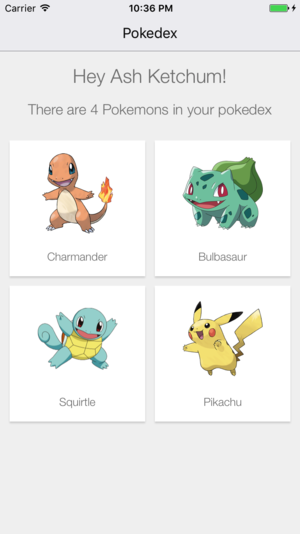
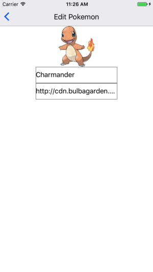

# Tutorial 03 - Advanced Queries

This is the third exercise in the **React Native Vanilla Track** of this Apollo Client Tutorial!

 <iframe width="560" height="315" src="https://www.youtube.com/embed/e4jZ1TUSC1Q" frameborder="0" allowfullscreen></iframe>

## Goal

In this exercise we will have a look at advanced query features with the **goal** of showing a list of pokemon that our trainer owns:



Upon clicking on a pokemon in this list, we will see a detailed view of that pokemon and can navigate back to the complete pokedex:



## Introduction

Move to the third exercise and install the dependencies from your console:

```sh
cd pokedex-react-native-vanilla/exercise-03
yarn install # or npm install
```

## Display a list of pokemon with advanced queries

Before we start working directly on our goal to show the pokemons a trainer owns, let's take some time to get more familiar with some of the available options when using queries.

### Static Query Variables

One of the available query options are variables. A common use case for query variables is when a query argument depends on some external factor, like a route parameter. Apollo takes care of escaping special characters (for example in JSON values or strings) and leverages the GraphQL type system when specifying variables.

For now we are introducing a query variable to the `TrainerQuery`. This is how it looked like at the end of the last exercise:

```js
const TrainerQuery = gql`
  query TrainerQuery {
    Trainer(name: "__NAME__") {
      name
    }
  }
`
```

To introduce a variable for the trainer `name`, we use the GraphQL notation for query variables. We have to add the `$name` argument to the query parameters and assign it to the `name` argument of `Trainer`:

```js@src/components/Pokedex.js
const TrainerQuery = gql`
  query TrainerQuery($name: String!) {
    Trainer(name: $name) {
      name
    }
  }
`
```

Note that we have to denote the variable type as well, `String!` signifying a required String in this case. Of course, now we also have to supply a value for that variable when we use it to wrap the `Pokedex` component:

```js@src/components/Pokedex.js
const PokedexWithData = graphql(TrainerQuery, {
  options: {
      variables: {
        name: "__NAME__"
      }
    }
  }
)(Pokedex)
```

### Nested Queries

Now that we saw query variables in action we can focus on displaying the pokemons of a given trainer. We will use the `PokemonPreview` component that you can find in `src/components/PokemonPreview.js` to display the individual pokemons:

```js
import React from 'react'
import { View, Image, TouchableHighlight, Dimensions } from 'react-native'
import CustomText from './CustomText'

import { Actions } from 'react-native-router-flux'

export default class PokemonPreview extends React.Component {

  static propTypes = {
    pokemon: React.PropTypes.object,
  }

  render () {
    const pokemonId = this.props.pokemon.id
    const {height, width} = Dimensions.get('window')

    return (
      <View
          style={{
            margin: 6,
            height: (width / 2) - 18,
            width: (width / 2) - 18,
            backgroundColor: 'white',
            padding: 16,
          }}
          shadowColor='rgba(0,0,0,0.25)'
          shadowOffset={{
            width: 0,
            height: 2
          }}
          shadowOpacity={0.5}
          shadowRadius={1}
        >
        <TouchableHighlight
          onPress={() => Actions.pokemonPage({pokemonId})}
          underlayColor='lightgray'
        >
          <View
            style={{
              flex: 1,
              alignItems: 'center',
              flexDirection: 'column'
            }}
          >
            <Image
              source={{ uri: this.props.pokemon.url }}
              style={{
                width: 100,
                height: 100,
                resizeMode: 'contain'
              }}
            />
            <CustomText
              style={{
                height: 20,
                marginTop: 20
              }}
            >{this.props.pokemon.name}</CustomText>
          </View>
        </TouchableHighlight>
      </View>
    )
  }
}
```

All it depends on is the `pokemon` prop, that we have to inject in the `Pokedex` component. Remember the structure of the `Trainer` and the `Pokemon` types:

```graphql
type Trainer {
  id: String!
  name: String!
  ownedPokemons: [Pokemon]
}

type Pokemon {
  id: String!
  url: String!
  name: String!
  trainer: Trainer
}
```

As we can see, the server stores the owned pokemons of each trainer, exactly the information that we need!
We can now add the `ownedPokemons` field to our `TrainerQuery` in the `Pokedex` component. Let's include the `id`, `url` and `name` in the nested selection:

```js@src/components/Pokedex.js
const TrainerQuery = gql`
  query TrainerQuery($name: String!) {
    Trainer(name: $name) {
      id
      name
      ownedPokemons {
        id
        name
        url
      }
    }
  }
`
```

Once the query has finished, `this.props.data.Trainer` in the `Pokedex` component contains the `ownedPokemons` object that gives access to the information we selected. We can now map over the pokemons in `ownedPokemons` to include the `PokemonPreview` components in the `render` method of the `Pokedex` component:

```js@src/components/Pokedex.js
render () {
  if (this.props.data.loading) {
    return (<CustomText style={{marginTop: 64}}>Loading</CustomText>)
  }

  if (this.props.data.error) {
    console.log(this.props.data.error)
    return (<CustomText style={{marginTop: 64}}>An unexpected error occurred</CustomText>)
  }

  return (
    <View style={{flex: 1, backgroundColor: '#f2f2f2'}}>
      <CustomText
        style={{
          marginTop: 64,
          padding: 16,
          fontSize: 24,
          textAlign: 'center'
        }}
      >
        Hey {this.props.data.Trainer.name}!
      </CustomText>
      <CustomText
        style={{
          padding: 16,
          paddingTop: 0,
          fontSize: 18,
          textAlign: 'center'
        }}
      >
        There are {this.props.data.Trainer.ownedPokemons.length} Pokemons in your pokedex
      </CustomText>
      <ScrollView>
        <View
          style={{
            flex: 1,
            flexDirection: 'row',
            alignItems: 'flex-start',
            flexWrap: 'wrap',
            margin: 6,
          }}
        >
          {this.props.data.Trainer.ownedPokemons.map((pokemon) =>
            <PokemonPreview key={pokemon.id} pokemon={pokemon} />
          )}
        </View>
      </ScrollView>
    </View>
  )
}
```

Note the use of `this.props.data.Trainer.ownedPokemons.length` that displays the correct amount of pokemons.

### Dynamic Query Variables

Cool, so now we can see all the pokemons we own in our pokedex. Verify that in your browser by running react-native:

```sh
react-native start
react-native run-ios # or react-native run-android
```

If everything is working, we can now continue to implement a detailed view of a single pokemon when we click on a `PokemonPreview` component.

Have a look at the `PokemonCard` component in `src/components/PokemonCard.js` that we prepared for you. It renders a pokemon passed in as a prop from its parent, the `PokemonPage` component in `src/components/PokemonPage.js`.

We already created a new route in `src/client.js` that assigns the `PokemonPage` to the path `pokemonPage`. The `PokemonPage` component expects a prop `pokemonId` to query a pokemon. In the render method of `PokemonPreview`, we use `Actions.pokemonPage({pokemonId})` to redirect to the `pokemonPage` path and supply the `pokemonId` as prop.

The `PokemonPage` component is responsible to pass down a pokemon to the `PokemonCard` component. Let's add a `PokemonQuery` now to `PokemonPage` that is fetching the required pokemon object:

```js@src/components/PokemonPage.js
const PokemonQuery = gql`
  query PokemonQuery($id: ID!) {
    Pokemon(id: $id) {
      id
      url
      name
    }
  }
`
```

As you can see, the query requires a query variable `id` of type `ID` that we have to supply using the query option `variables` as before. However, other than with the trainer name variable, we cannot just use a cannot value as the id in our case. For that reason, we have the possibility to access the props when creating the `variables` object. So, we can replace:

```js
export default PokemonPage
```

with:

```js@src/components/PokemonPage.js
const PokemonPageWithData = graphql(PokemonQuery, {
    options: (ownProps) => {
      return {
        variables: {
          id: ownProps.pokemonId
        }
      }
    }
  }
)(PokemonPage)

export default PokemonPageWithData
```

Now we can replace the placeholder content of the render method in `PokemonPage` with the `PokemonCard` component:

```js@src/components/PokemonPage.js
class PokemonPage extends React.Component {

  static propTypes = {
    data: React.PropTypes.shape({
      loading: React.PropTypes.bool,
      error: React.PropTypes.object,
      Pokemon: React.PropTypes.object,
    }).isRequired,
  }

  render () {
    if (this.props.data.loading) {
      return (<Text style={{marginTop: 64}}>Loading</Text>)
    }

    if (this.props.data.error) {
      console.log(this.props.data.error)
      return (<View style={{marginTop: 64}}>An unexpected error occurred</View>)
    }

    const pokemon = this.props.data.Pokemon

    return (
      <View
        style={{
          flex: 1,
          marginTop: 64
        }}
      >
        <PokemonCard pokemon={pokemon}/>
      </View>
    )
  }
}
```

Note that we introduced the new required `data` prop and guarded its usage again with the boolean `data.loading`. If an error occurs, we notify the user.

Run the app and you should see a list of pokemons:

run react-native:

```sh
react-native start
react-native run-ios # or react-native run-android
```

Click on a pokemon preview to move over to the detailed view. Click the back button to return back to your pokedex.

## Recap

Nice, our pokedex starts to get some shape! We added both an overview of all our pokemons as well as a detailed view of a single pokemon. Let's go through what we saw in this exercise again:

* **Constants as query variables** helped us getting started with advanced query features
* Using GraphQL, we can easily create **nested queries**
* Combining **router parameters** and **dynamic query variables**, we were able to supply different data to the same component to quickly control what concent we want to render.
