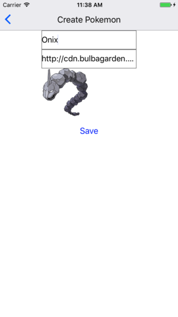
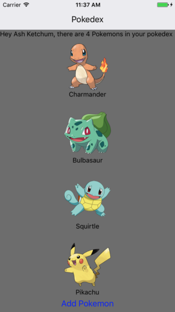

# Tutorial 05 - Basic Mutations

Welcome to the 5th exercise in the **React Native Vanilla Track** of this Apollo Client Tutorial!

## Goal

In this exercise we have the **goal** of adding the possibility to create new pokemons:



A button in the pokedex will redirect to the new component. After creating the pokemon it will appear in our pokedex:



Data changes in GraphQL are done by using mutations, so it's time for us to learn about them.

## Introduction

Move to the 5th exercise and install the dependencies from your console:

```sh
cd pokedex-react/exercise-05
yarn install # or npm install
```

## Adding new pokemons to the pokemon list

Currently we have a cool, shiny list of pokemons that are assigned to our trainer node. However, pokemon trainers are supposed to catch new pokemons once in a while, so we should account for that in our pokedex.

### Adding a button to the `Pokedex`

We already prepared a new component `AddPokemonCard` that lets us create new pokemons and associated it with the `createPokemon` route in `src/index.js`:

```js
const scenes = Actions.create(
  <Scene key='root'>
    <Scene key='pokedex' component={Pokedex} title='Pokedex' initial={true} type={ActionConst.RESET} />
    <Scene key='pokemonPage' title='Edit Pokemon' component={PokemonPage} type={ActionConst.PUSH} />
    <Scene key='createPokemon' title='Create Pokemon' component={AddPokemonCard} type={ActionConst.PUSH} />
  </Scene>
)
```

We can now add a new button to our `Pokedex` component that redirects to the new `AddPokemonCard` component.

As we need to know which trainer gets assigned the new pokemon, we pass the trainer id when redirecting. This is the new `render` method of `Pokedex`:

```js@src/components/Pokedex.js
render () {
  if (this.props.data.loading) {
    return (<Text style={{marginTop: 64}}>Loading</Text>)
  }

  if (this.props.data.error) {
    console.log(this.props.data.error)
    return (<Text style={{marginTop: 64}}>An unexpexted error occured</Text>)
  }

  return (
    <View style={{flex: 1, backgroundColor: 'gray'}}>
      <Text style={{marginTop: 64}}>
        Hey {this.props.data.Trainer.name}, there are {this.props.data.Trainer.ownedPokemons.length} Pokemons in your pokedex
      </Text>
      <ScrollView>
        <View
          style={{
            flex: 1,
            flexDirection: 'column',
            justifyContent: 'center',
            alignItems: 'center',
          }}
        >
          {this.props.data.Trainer.ownedPokemons.map((pokemon) =>
            <PokemonPreview key={pokemon.id} pokemon={pokemon} />
          )}
        </View>
      </ScrollView>
      <Button
        title='Add Pokemon'
        onPress={() => {
          const trainerId = this.props.data.Trainer.id
          Actions.createPokemon({trainerId})
        }}
      />
    </View>
  )
}
```

Note that we require the trainer id now but didn't need it before, so we should add it to our `TrainerQuery` as well:

```js@src/components/Pokedex.js
const TrainerQuery = gql`
  query TrainerQuery($name: String!) {
    Trainer(name: $name) {
      id
      name
      ownedPokemons {
        id
        name
        url
      }
    }
  }
`
```

### Adding the createPokemon mutation to `AddPokemonCard`

Right now, the `AddPokemonCard` doesn't do too much. As we want to create a new pokemon node at the server, now is the time to think about the right mutation for this. Let's first think about the data that is needed for creating a new pokemon. Of course, we need the name and the image URL of the new pokemon. Additionally we also need the trainer id to relate the pokemon to the trainer and vice-versa. The mutation we need to use is called `createPokemon`, which leaves us with the following mutation:

```js@src/components/AddPokemonCard.js
const createPokemonMutation = gql`
  mutation createPokemon($name: String!, $url: String!, $trainerId: ID) {
    createPokemon(name: $name, url: $url, trainerId: $trainerId) {
      trainer {
        id
        ownedPokemons {
          id
        }
      }
    }
  }
`
```

Note that as we discussed above, the mutation requires the variables `$name`, `$url` and `$trainerId`. Instead of only using `export default AddPokemonCard` we can inject the mutation similar to how we inject queries to `AddPokemonCard`:

```js@src/components/AddPokemonCard.js
const AddPokemonCardWithMutation = graphql(createPokemonMutation)(AddPokemonCard)

export default AddPokemonCardWithMutation
```

But wait, how do we supply the needed variables to the mutation? Let's find out!

### Using mutations in components

Other than with queries, injecting mutations doesn't add the query result but the mutation itself as a function. Inside the wrapped component, we can access the mutation via `this.props.mutate`, which is a function that accepts the mutation variables as parameters. So let's first add the new required prop `mutate` at the top of the `AddPokemonCard` class:

```js@src/components/AddPokemonCard.js
static propTypes = {
  mutate: React.PropTypes.func.isRequired,
}
```

Now we can call the `createPokemon` mutations by using `mutate` in `handleSave`:

```js@src/components/AddPokemonCard.js
handleSave = () => {
  const {name, url} = this.state
  const trainerId = this.props.trainerId
  this.props.mutate({variables: {name, url, trainerId}})
    .then(() => {
      Actions.pokedex()
    })
}
```

Note how we provide the variables using the `variables` object. As you can see, the mutation return a promise, so we can chain another function by using `then` to return back to the pokemon list.

Check if you got everthing right by running react-native:

```sh
react-native start
react-native run-ios # or react-native run-android
```


Click the add button. Add the pokemon name and image URL and click the save button. Weird, the pokemon is not displayed right away, only after refreshing the page. To fix this, we have to do one more thing. Head over to `src/client.js` and replace the creation of Apollo Client by this:

```js@src/client.js
const client = new ApolloClient({
  networkInterface: createNetworkInterface({ uri: 'https://api.graph.cool/simple/v1/__PROJECT_ID__'}),
  dataIdFromObject: o => o.id
})
```

Note that we added the `dataIdFromObject` attribute that maps an object to the id field on that objects. Go back to your app and confirm that creating a new pokemon is reflected in the pokedex without refreshing.

## Recap

Now that you got to use mutations you already know a lot about Apollo Client, good job! Let's review what we saw in this exercise:

* **Mutations** are used to change data on the server
* Calling mutations returns a **promise that can be used to react on mutation results**
* **Wrapping a component with `graphql`** from `react-apollo` using a mutation injects the `mutate` prop to the inner component
* Other than with queries, **mutation variables can be assigned in the inner component** making it easy to use the components state as variable inputs
