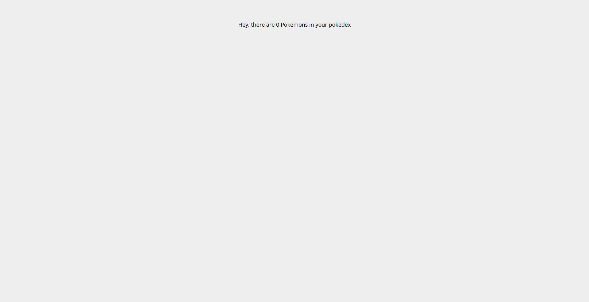

# Tutorial 01 - Getting Started

Welcome to the first exercise in the **React Track** of this Apollo Client Tutorial! If you prefer React Native, Angular 2 or Vue.js over React, head over to the respective tutorial track.

<iframe width="560" height="315" src="https://www.youtube.com/embed/TiqPHEzSOg0?list=PLn2e1F9Rfr6neWxkWtlTAwshh07-m1p5I" frameborder="0" allowfullscreen></iframe>
## Goal

The **goal** of this first exercise is to install a React App and run it afterwards. You will get familiar with the infrastructure surrounding Apollo Client for React and with the app structure of the Pokedex.

We will see a generic greeting in our pokedex at the end of this exercise:



## Introduction

Sign up with GitHub to receive your own `pokedex-react` here:

<!-- __DOWNLOAD_REACT__ -->

Now change to the first exercise, install the dependencies and start the app from your console

```sh
cd pokedex-react/exercise-01
yarn install # or npm install
yarn start # or npm start
```

## Getting Familiar with the app

Let's take a moment to get more familiar with the structure of the app.

The starting point for our app is `src/index.js`. At the moment, all that happens here is setting up the router to render the `Pokedex` component for the `/` route path:

```js
ReactDOM.render((
  <Router history={browserHistory}>
    <Route path='/' component={Pokedex} />
  </Router>
  ),
  document.getElementById('root')
)
```

## Adding Apollo Client to the app

We can add Apollo Client to our app by adding the following changes to `src/index.js`.

### Package Dependencies

Open `src/package.json` to have a look what packages we are using.

* `apollo-client` - the core package exposes the vanilla JS Apollo Client which provides the core functionality
* `react-apollo` - the React integration exposes the `ApolloProvider` that can be used to wrap other React components, allowing them to send queries and mutations

Now go ahead and import the following at the top of `src/index.js`:

```js@src/index.js
import ApolloClient, { createNetworkInterface } from 'apollo-client'
import { ApolloProvider } from 'react-apollo'
```

### Configuring Apollo Client with our GraphQL server

Now we can connect Apollo Client with our GraphQL server by configuring the network layer. Paste the following right after the imports in `src/index.js`:

```js@src/index.js
const client = new ApolloClient({
  networkInterface: createNetworkInterface({ uri: 'https://api.graph.cool/simple/v1/__PROJECT_ID__'}),
})
```

If you signed up with GitHub and downloaded the example, we already took care of this step for the following exercises.

### Connecting Apollo Client to our React components

To allow our React components to issue GraphQL queries and mutations through the client we wrap them with the `ApolloProvider` component in `src/index.js `from the `react-apollo` package. Go ahead and update the call to `ReactDOM.render` in `src/index.js`:

```js@src/index.js
ReactDOM.render((
  <ApolloProvider client={client}>
    <Router history={browserHistory}>
      <Route path='/' component={Pokedex} />
    </Router>
  </ApolloProvider>
  ),
  document.getElementById('root')
)
```

As we are using `react-router` to handle our routes, we wrap the `Router` component. Note that the `/` route points to the `Pokedex` component.

> Note: You don't have to put `ApolloProvider` on the highest level of the component hierarchy - however, every component that wants to use Apollo Client needs to be a direct or indirect child of `ApolloProvider` in the component hierarchy.

Our Pokedex component lives in `src/components/Pokedex.js`. Currently, it only contains a generic greeting, but that will change soon! We will further expand this component in the following exercises to give an overview about all the pokemon in your pokedex as well as the possibility to add new pokemons or update existing ones. But for now, let's make sure you are ready to go.

## Starting the app

To confirm your environment is all correctly setup, open [http://localhost:3000](http://localhost:3000) in your browser and you should see the greeting from the Pokedex component.

## Recap

Great, you did it! You successfully ran the React app and got familiar with its general structure. Let's quickly summarize what we learned so far:

* To use **Apollo Client**, we need to import it from `apollo-client` and setup its **networkInterface**
* We can **issue queries and mutations** in our React components by wrapping them in the **Apollo Provider** found in `react-apollo`
* We will use the **Pokedex component** to list our pokemons and to offer other features
