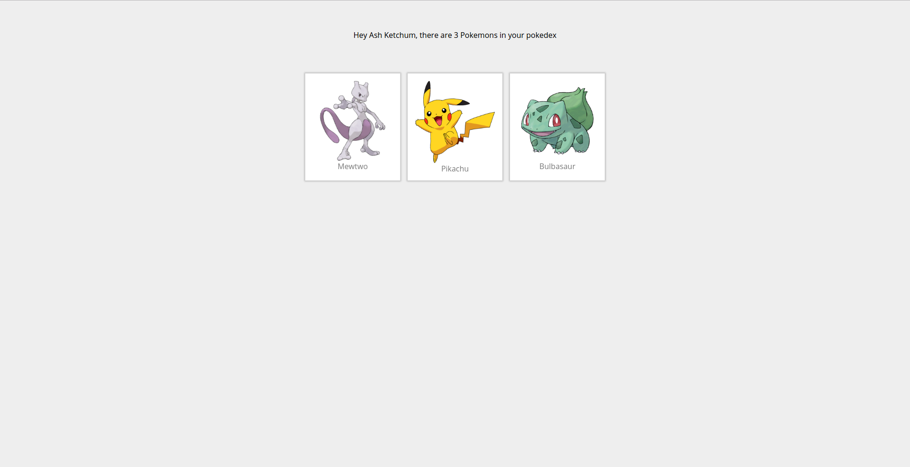
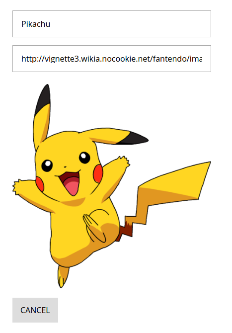

# Tutorial 03 - Advanced Queries

This is the third exercise in the **React Track** of this Apollo Client Tutorial!

<iframe width="560" height="315" src="https://www.youtube.com/embed/e4jZ1TUSC1Q?list=PLn2e1F9Rfr6neWxkWtlTAwshh07-m1p5I" frameborder="0" allowfullscreen></iframe>
## Goal

In this exercise we will have a look at advanced query features with the **goal** of showing a list of pokemon that our trainer owns:



Upon clicking on a pokemon in this list, we will see a detailed view of that pokemon and can navigate back to the complete pokedex:



## Introduction

Move to the third exercise, install the dependencies and start the pokedex React app from your console

```sh
cd pokedex-react/exercise-03
yarn install # or npm install
yarn start # or npm start
```

## Display a list of pokemons with advanced queries

Before we start working directly on our goal to show the pokemons a trainer owns, let's take some time to get more familiar with some of the available options when using queries.

### Static Query Variables

One of the available query options are variables. A common use case for query variables is when a query argument depends on some external factor, like a route parameter. Apollo takes care of escaping special characters (for example in JSON values or strings) and leverages the GraphQL type system when specifying variables.

For now we are introducing a static query variable to the `TrainerQuery`. This is how the query looked like at the end of the last exercise:

```js
const TrainerQuery = gql`
  query TrainerQuery {
    Trainer(name: "__NAME__") {
      name
    }
  }
`
```

To introduce a variable for the trainer `name`, we use the GraphQL notation for query variables. We have to add the `$name` argument to the query parameters and assign it to the `name` argument of `Trainer`:

```js@src/component/Pokedex.js
const TrainerQuery = gql`
  query TrainerQuery($name: String!) {
    Trainer(name: $name) {
      name
    }
  }
`
```

Note that we have to denote the variable type as well, `String!` signifying a required String in this case. Of course, now we also have to supply a value for that variable when we use it to wrap the `Pokedex` component:

```js@src/component/Pokedex.js
const PokedexWithData = graphql(TrainerQuery, {
  options: {
    variables: {
      name: "__NAME__"
    }
  }
})(Pokedex)
```

### Nested Queries

Now that we saw query variables in action we can focus on displaying the pokemons of a given trainer. We will use the `PokemonPreview` component that you can find in `src/components/PokemonPreview.js` to display the individual pokemons:

```js
import React from 'react'

export default class PokemonPreview extends React.Component {

  static propTypes = {
    pokemon: React.PropTypes.object,
  }

  render () {
    return (
      <div className='dib mw4 tc black link dim ml1 mr1 mb2 bg-white pa2'>
        <div className='db'>
          
        </div>
        <span className='gray'>{this.props.pokemon.name}</span>
      </div>
    )
  }
}

```

All it depends on is the `pokemon` prop, that we have to inject in the `Pokedex` component. Remember the structure of the `Trainer` and the `Pokemon` types:

```graphql
type Trainer {
  id: String!
  name: String!
  ownedPokemons: [Pokemon]
}

type Pokemon {
  id: String!
  url: String!
  name: String!
  trainer: Trainer
}
```

As we can see, the server stores the owned pokemons of each trainer, exactly the information that we need!
We can now add the `ownedPokemons` field to our `TrainerQuery` in the `Pokedex` component. Let's include the `id`, `url` and `name` in the nested selection:

```js@src/component/Pokedex.js
const TrainerQuery = gql`
  query TrainerQuery($name: String!) {
    Trainer(name: $name) {
      id
      name
      ownedPokemons {
        id
        name
        url
      }
    }
  }
`
```

Once the query has finished, `this.props.data.Trainer` in the `Pokedex` component contains the `ownedPokemons` object that gives access to the information we selected. We can now map over the pokemons in `ownedPokemons` to display them using `PokemonPreview` components in the `render` method of `Pokedex`:

```js@src/component/Pokedex.js
render () {
  if (this.props.data.loading) {
    return (<div>Loading</div>)
  }

  if (this.props.data.error) {
    console.log(this.props.data.error)
    return (<div>An unexpexted error occured</div>)
  }

  return (
    <div className='w-100 bg-light-gray min-vh-100'>
      <div className='tc pt4'>
        Hey {this.props.data.Trainer.name}, there are {this.props.data.Trainer.ownedPokemons.length} Pokemons in your pokedex
      </div>
      <div className='flex flex-wrap items-stretch pt5 center mw7'>
        {this.props.data.Trainer.ownedPokemons.map((pokemon) =>
          <PokemonPreview key={pokemon.id} pokemon={pokemon} />
        )}
      </div>
    </div>
  )
}
```

Note the use of `this.props.data.Trainer.ownedPokemons.length` that displays the correct amount of pokemons.

### Dynamic Query Variables

Cool, so now we can see all the pokemons we own in our pokedex. Verify that in your browser by visiting [http://localhost:3000](http://localhost:3000). If everything is working, we can now continue to implement a detailed view of a single pokemon when we click on a `PokemonPreview` component. Have a look at the `PokemonCard` component in `src/components/PokemonCard.js` that we prepared for you. It renders a pokemon passed in as a prop from its parent, the `PokemonPage` component in `src/components/PokemonPage.js`.

We already created a new route in `src/index.js` that assigns the `PokemonPage` to the path `view/:pokemonId` so we can use the path parameter `pokemonId` to query a pokemon. You now have to change the render method of `PokemonPreview` so that it includes the `Link` component from `react-router` that redirects to the `view/:pokemonId` path:

```js
render () {
  return (
    <Link
      to={`/view/${this.props.pokemon.id}`}
      style={{ minWidth: 200 }}
      className='link dim grow mw4 bg-white ma2 pa3 shadow-1'
    >
      
      <div className='gray tc'>{this.props.pokemon.name}</div>
    </Link>
  )
}
```

The `PokemonPage` component is responsible to pass down a pokemon to the `PokemonCard` component. Let's add a `PokemonQuery` to `PokemonPage` that is fetching the required pokemon object:

```js@src/component/PokemonPage.js
const PokemonQuery = gql`
  query PokemonQuery($id: ID!) {
    Pokemon(id: $id) {
      id
      url
      name
    }
  }
`
```

As you can see, the query requires a query variable `id` of type `ID` that we have to supply using the query option `variables` as before. However, other than with the trainer name variable, we cannot just use a cannot value as the id in our case. For that reason, we have the possibility to access the props when creating the `variables` object. So, we can replace:

```js
export default withRouter(PokemonPage)
```

with:

```js@src/component/PokemonPage.js
const PokemonPageWithQuery = graphql(PokemonQuery, {
  options: (ownProps) => ({
    variables: {
      id: ownProps.params.pokemonId
    }
  })
})(withRouter(PokemonPage))

export default PokemonPageWithQuery
```

Now we can replace the placeholder content of the render method in `PokemonPage` with the `PokemonCard` component:

```js@src/component/PokemonPage.js
class PokemonPage extends React.Component {

  static propTypes = {
    data: React.PropTypes.shape({
      loading: React.PropTypes.bool,
      error: React.PropTypes.object,
      Pokemon: React.PropTypes.object,
    }).isRequired,
    router: React.PropTypes.object.isRequired,
    params: React.PropTypes.object.isRequired,
  }

  render () {
    if (this.props.data.loading) {
      return (<div>Loading</div>)
    }

    if (this.props.data.error) {
      console.log(this.props.data.error)
      return (<div>An unexpexted error occured</div>)
    }

    return (
      <div>
        <PokemonCard pokemon={this.props.data.Pokemon} handleCancel={this.goBack}/>
      </div>
    )
  }

  goBack = () => {
    this.props.router.replace('/')
  }
}
```

Note that we introduced the new required `data` prop and guarded its usage again with `data.loading`. If an error occurs, we notify the user.

Open [http://localhost:3000](http://localhost:3000) in your browser and you should see a list of pokemons. Click on a pokemon preview to see its detailed view. Click the cancel button to return back to your pokedex.

## Recap

Nice, our pokedex starts to get some shape! We added both an overview of all our pokemons as well as a detailed view of a single pokemon. Let's go through what we saw in this exercise again:

* **Constants as query variables** helped us getting started with advanced query features
* Using GraphQL, we can easily create **nested queries**
* Combining **router parameters** and **dynamic query variables**, we were able to supply different data to the same component to quickly control what concent we want to render.
