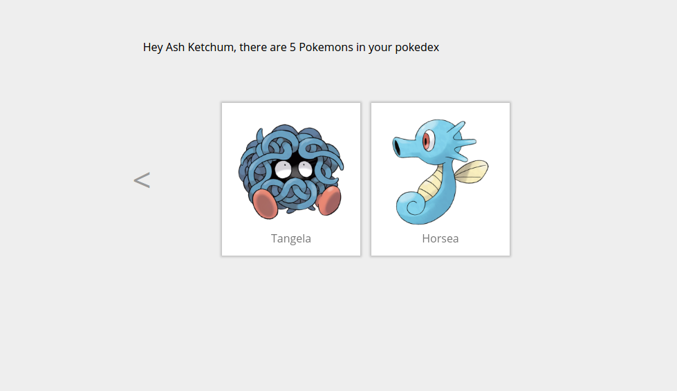

# Tutorial 07 - Pagination

Welcome to the 7th exercise in the **React Track** of this Apollo Client Tutorial!

<iframe width="560" height="315" src="https://www.youtube.com/embed/xloj6Rh3R54" frameborder="0" allowfullscreen></iframe>

## Goal

The **goal** in this exercise is to use pagination to provide a better browsing experience:





## Introduction

Change to the 7th exercise, install the dependencies and run the Pokedex React App from your console

```sh
cd pokedex-react/exercise-07
yarn install # or npm install
yarn start # or npm start
```

## Browsing the Pokedex

We want to allow the browsing of pokemons in different pages.

### Preparing the pages

As we want to organize pokemons in different pages, we already added some changes to our routes in `index.js`:

```js
ReactDOM.render((
    <ApolloProvider client={client}>
      <Router history={browserHistory}>
        <Route path='/' component={Pokedex}>
          <IndexRedirect to='/1' />
          <Route path='/:page' component={Pokedex} />
        </Route>
        <Route path='/view/:pokemonId' component={PokemonPage} />
        <Route path='/create/:trainerId' component={AddPokemonCard} />
      </Router>
    </ApolloProvider>
  ),
  document.getElementById('root')
)
```

At the `/` path, we added a new route with the parameter `:page`. Later we want to see the first three pokemons on the first page, the next 3 pokemons on the second page and so on. That's why we already added a bit of page logic in `Pokedex.js`:

```js
  _nextPage = () => {
    this.props.router.replace(`/${+this.props.params.page + 1}`)
  }

  _previousPage = () => {
    this.props.router.replace(`/${+this.props.params.page - 1}`)
  }

  _isFirstPage = () => {
    return this.props.params.page === '1'
  }

  _isLastPage = () => {
    return this.props.data.Trainer._ownedPokemonsMeta.count <= this.props.params.page * POKEMONS_PER_PAGE
  }
//...
```

We provide two methods to transition to the next or previous page, and two to check if we are on the first or last page.
Note that we use the `_ownedPokemonsMeta.count` meta information that the server provides us with on the `Trainer` object.
Of course, we also included it in the query itself as well:

```js
const TrainerQuery = gql`query TrainerQuery($name: String!) {
  Trainer(name: $name) {
    id
    name
    ownedPokemons {
      id
      name
      url
    }
    _ownedPokemonsMeta {
      count
    }
  }
}`
```

With these preparations, you are now ready to actually implement pagination in your pokedex!

### Offset-based pagination

The [Apollo documentation](http://dev.apollodata.com/react/pagination.html) has more information on different pagination concepts. In this exercise, we will focus on offset-based pagination. That is, we express how many pokemons we want to query, and how many we want to skip.
Our server offers the `first` and `skip` parameters for the `ownedPokemons` field of the `Trainer` query, that give us exactly that functionality!

So go ahead and add the `first` and `skip` variables to the `TrainerQuery` in `Pokedex.js` like this:

```js
const TrainerQuery = gql`query TrainerQuery($name: String!, $first: Int!, $skip: Int!) {
  Trainer(name: $name) {
    id
    name
    ownedPokemons(first: $first, skip: $skip) {
      id
      name
      url
    }
    _ownedPokemonsMeta {
      count
    }
  }
}`
```

What values do we pass to these variables? For `first`, we always pass `POKEMONS_PER_PAGE` which is three in our case. However, the value we pass for the `skip` variable depends on the current page, that is accessible with the `params` props. We can access the props when setting query options like this:

```js
const PokedexWithData = graphql(TrainerQuery, {
    options: (ownProps) => ({
      variables: {
        name: '__NAME__',
        skip: (
          ownProps.params &&
          ownProps.params.page &&
          (ownProps.params.page - 1) * POKEMONS_PER_PAGE
        ) || 0,
        first: POKEMONS_PER_PAGE,
      },
      forceFetch: true,
    })
  }
)(withRouter(Pokedex))

export default PokedexWithData
```

All that you have to do now is to update `render` method of `Pokedex.js`. Before actually rendering, we make sure that the `params.page` in the props is a sensible number, if not we navigate to the first page. If all is well, we include the prepared `PageNavigation` component in the `render` method of `Pokedex.js` to allow the user to browse through the different pages:

```js
render () {
  if (this.props.data.loading) {
    return (<div>Loading</div>)
  }

  if (this.props.data.error) {
    console.log(this.props.data.error)
    return (<div>An unexpexted error occured</div>)
  }

  if ((this.props.data.Trainer._ownedPokemonsMeta.count === 0 && !this._isFirstPage())
    || isNaN(this.props.params.page)
    || this.props.data.Trainer._ownedPokemonsMeta.count < (this.props.params.page - 1) * POKEMONS_PER_PAGE
    || this.props.params.page < 1) {
    this.props.router.replace('/1')
  }

  return (
    <div className='w-100 bg-light-gray min-vh-100'>
      <div className='tc pa5'>
        Hey {this.props.data.Trainer.name}, there are {this.props.data.Trainer._ownedPokemonsMeta.count} Pokemons in your pokedex
      </div>
      <div className='flex flex-wrap justify-center center w-75'>
        {!this._isFirstPage() && <PageNavigation onClick={this._previousPage} isPrevious={true} />}
        {this.props.params.page === '1' && <AddPokemonPreview trainerId={this.props.data.Trainer.id} />}
        {this.props.data.Trainer.ownedPokemons.map((pokemon) =>
          <PokemonPreview key={pokemon.id} pokemon={pokemon} />
        )}
        {!this._isLastPage() && <PageNavigation onClick={this._nextPage} isPrevious={false} />}
      </div>
    </div>
  )
}
```

Open [http://localhost:3000](http://localhost:3000) in your browser and navigate through your existing pokemons. Create and delete pokemons and check that the pagination works for different amount of pokemons.

## Recap

* We saw how we can use **first and skip** to realize **offset-based pagination**
* When setting query variables, **inner props** like **router params** can be accessed to modify the query
